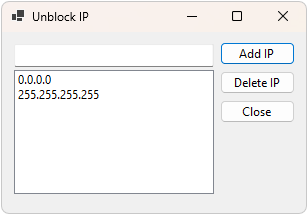

# UnblockIP for IPBan



This is a simple Windows Forms application designed to manage a list of IP addresses for unblocking. It allows users to enter IP addresses, validate them, and save them to a file (`history_unban.txt`). The application also loads previously saved IP addresses and allows users to delete them from the list and the file.

## Features

- Enter IP addresses into a `ListBox`
- Validate IP addresses to ensure they are in the correct format (0.0.0.0 to 255.255.255.255)
- Save IP addresses to `history_unban.txt`
- Load IP addresses from `history_unban.txt`
- Delete IP addresses from the list and the file

## Getting Started

### Prerequisites

- .NET Framework (version 4.7.2 or later)
- Visual Studio (2019 or later)

### Installing

1. Clone the repository:

    ```bash
    git clone https://github.com/alexander-yermolenko/unblockIP_forIPBan.git
    ```

2. Open the solution in Visual Studio.

3. Build the solution to ensure there are no errors.

4. Run the application.

## Usage

1. Enter an IP address in the input box.
2. Click the "Add IP" button to add the IP address to the list.
3. The IP address will be validated to ensure it is in the correct format.
4. If the IP address is valid, it will be saved to `history_unban.txt` and displayed in the `ListBox`.
5. To delete an IP address, select it from the list and click the "Delete IP" button.

## Packaging the Application

To package the application into a single executable file:

1. Open the project in Visual Studio.
2. Edit the `.csproj` file to include the following properties:

    ```xml
    <PropertyGroup>
        <OutputType>Exe</OutputType>
        <TargetFramework>net5.0-windows</TargetFramework> <!-- or netcoreapp3.1 -->
        <PublishSingleFile>true</PublishSingleFile>
        <RuntimeIdentifier>win-x64</RuntimeIdentifier> <!-- or win-x86 for 32-bit -->
        <SelfContained>true</SelfContained>
    </PropertyGroup>
    ```

3. Publish the application:
    - Right-click the project in Solution Explorer.
    - Select `Publish`.
    - Choose a folder as the target.
    - Click `Publish`.

4. The published executable can be found in the specified folder.

## License

This project is licensed under the MIT License - see the LICENSE file for details.